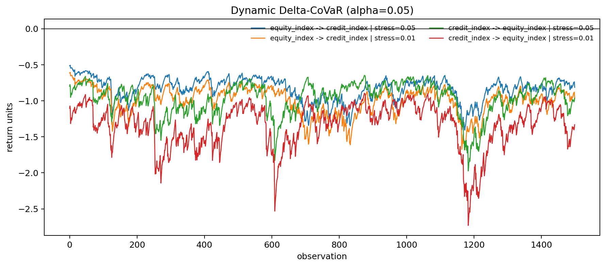

# Systemic Risk Spillover CoVaR Lab

This is my research project for measuring **directional tail-risk spillovers** between financial assets. I built the pipeline around GARCH volatility filters, copula dependence models, and CoVaR, with a quantile-regression benchmark for comparison.

## What this project demonstrates

- GARCH(1,1) filtering with skewed Student-t innovations
- Semiparametric probability-integral transforms
- Gaussian, Clayton, Gumbel, and Frank copulas fitted by maximum likelihood
- Automatic copula selection using AIC
- Dynamic CoVaR and Delta-CoVaR in both spillover directions
- Quantile-regression CoVaR as an independent benchmark
- Moving-block bootstrap confidence intervals and rolling-window estimates
- Reproducible synthetic data and publication-ready output

The direction matters: `A -> B` measures the change in the tail risk of B when A moves from its median state to distress. It need not equal `B -> A`.

## Methodology

For each asset, a GARCH(1,1) model estimates conditional mean and volatility. Ranked standardized residuals form copula pseudo-observations. The best dependence family is selected by

```text
AIC = -2 log(L) + 2k
```

The selected copula supplies a conditional probability, which is mapped through the outcome asset's empirical innovation distribution. Dynamic Delta-CoVaR is the difference between CoVaR under a stressed conditioning asset and CoVaR under its median state.

As a robustness check, the project also estimates a linear quantile model:

```text
Q_alpha(Y | X) = intercept_alpha + beta_alpha X
```

## Quick start

Requires Python 3.9 or newer.

```bash
python -m venv .venv
source .venv/bin/activate
pip install -r requirements.txt
python scripts/generate_demo_data.py
python main.py --data data/demo_returns.csv --assets equity_index credit_index
```

Outputs are saved under `results/`:

- `risk_summary.csv`: concise directional spillover estimates
- `pair_analysis.json`: model parameters and complete time series
- `delta_covar.png`: dynamic spillover visualization



The demo dataset can be generated by generate_demo_data.py and is not stored in this repository.

## Local data

The program accepts a wide CSV or Excel file with a `date` column followed by one column per asset:

```text
date,asset_a,asset_b
2024-01-02,0.42,-0.18
2024-01-03,-0.31,0.07
```

Missing dates are allowed; rows containing missing asset values are aligned and removed.

For returns already expressed in percentage points:

```bash
python main.py --data data/my_returns.csv --input-type returns --assets SP500 BANKS
```

For price levels, add `--input-type prices`; the loader calculates percentage log returns.

## Repository layout

```text
.
├── main.py                    # command-line workflow
├── scripts/generate_demo_data.py
├── src/
│   ├── analysis_runner.py     # orchestration and summaries
│   ├── copula_model.py        # dependence estimation
│   ├── covar_calculator.py    # dynamic CoVaR
│   ├── data_loader.py         # validated input pipeline
│   ├── garch_model.py         # marginal volatility models
│   ├── quantile_model.py      # robustness benchmark
│   └── visualization.py
└── tests/
```

## Interpretation and limitations

More-negative lower-tail Delta-CoVaR indicates stronger downside spillover in the outcome asset's return units. CoVaR is a conditional risk measure, not proof of causality. Estimates can be sensitive to the sample period, marginal specification, copula family, and tail probability. This project is intended for research and portfolio demonstration, not investment advice.

## Note

This repository is a personal research portfolio. The source code is publicly visible for review, while the datasets and generated result files remain local.
